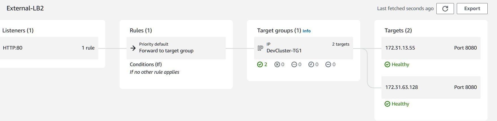
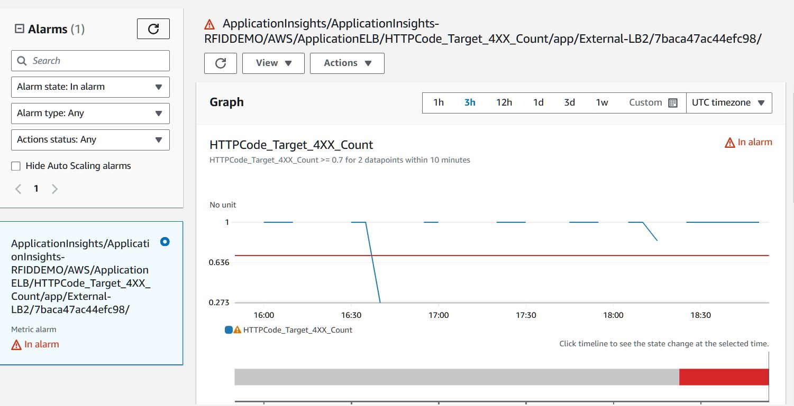

# Getting Started

### Database
1. Data Modeling:

* 
* My primary tables are Site, Location, Product, Rfid, and RfidTx.
  
* The Site table represents physical sites, each of which can have multiple Location entries, indicating specific areas within the site.
  
* The Location table is linked to Site via a many-to-one relationship, with each location belonging to a single site.
  
* The Product table stores information about items associated with RFID tags, where each product can be linked to multiple RFID tags through the Rfid table.
  
* The Rfid table represents the RFID tags themselves, each identified by a unique combination of tagId and epc , and is associated with a Product through a many-to-one relationship.
  
* The RfidTx table records transactions or scans involving these RFID tags, with each transaction linked to a specific Rfid, Location, and time, reflecting a detailed history of RFID scans within specific locations at particular sites.
  _This structure supports comprehensive tracking and management of RFID-tagged items across various locations and sites._

* In MySql primary keys are automatically indexed upon table creation because they uniquely identify each record and are frequently used in lookup operations.
Similarly foreign keys were indexed to speed up JOIN operations between different tables,
The Rfid and RfidTx entities use composite keys that are also indexed in order to improve the performance of the queries that filter by these combinations.
_There is no need to add any more indexes in order not to create an unnecessary overhead when we update, insert or delete._

* I did not apply partitioning directly to the RFIDTX table or any other table mentioned above,Since foreign keys are not supported with partitioned tables in MySql yet.Partitioning the Rfidtx table by date would require me to handle referential integrity myself in the code which would addd too much work and make my code more prone to bugs.

* I used partitioning on the data when querying for the latest RFID scans.
By partitioning the data based on the EPC, the query is able to calculate the count of transactions and the average RSSI within each group of records sharing the same EPC. This approach allows the query to handle large datasets more effectively by isolating the calculations within each partition, rather than across the entire dataset. Additionally, partitioning enables the query to determine the most recent scan for each EPC using the ROW_NUMBER() function, which assigns a unique rank to each scan within its EPC group, ordered by the scan date in descending order. This method ensures that the latest scan details are selected for each EPC, providing accurate and efficient retrieval of the required information

2. AWS DB Setup
* I created an Aurora MySQL cluster and associated resources in the `us-west-2` region and ensured data encryption by creating a KMS key (Aurora-Key) , which i specified during the cluster creation. This setup guarantees that all data stored in the cluster is encrypted with the KMS key.

* To achieve high availability, I configured the Aurora MySQL cluster to use a DB Subnet Group spanning multiple Availability Zones (us-west-2a,us-west-2b,us-west-2c,us-west-2d). This configuration allows the database to remain operational even if one AZ encounters issues, as Aurora automatically handles failover betien primary and replica instances, minimizing downtime.
   The DB Subnet Group was set up with multiple subnets across different AZs to ensure resilience and to place the database within controlled network segments of our VPC, enhancing network traffic management and security.
   Additionally, i created a security group to control access to the Aurora MySQL cluster, specifying which IP addresses and ranges are alloid to connect on port 3306. This security group restricts access to authorized IP addresses only, reducing the risk of unauthorized access and attacks.

* By setting inbound and outbound rules, i isolated the Aurora MySQL cluster from other resources in the VPC that do not need direct access, thus providing an additional layer of security.

* To monitor the Aurora MySQL cluster effectively, i set up CloudWatch Alarm (Aurora-MySql-CPUAlarm) and Metrics(Aurora-MYSQL-Dashboard).

* I configured CloudWatch to track: CPU utilization, number of queries, and free storage space.
   An alarm (Aurora-MySql-CPUAlarm) is triggered and an email is sent via an SNS topic called "AlarmTopic" if the CPU utilization  of the db cluster exceeds 80% for 5 minutes, indicating potential performance issues.
   _These alarms and metrics help ensure the database's health and performance are closely monitored, enabling us to address issues before they impact the cluster's availability or performance._

### Service

* My service is called demorfid,it's a web application built using Spring Boot, designed to run as a WAR package on a server. It leverages a variety of Spring Boot starters, including data JPA for database interactions, security for authentication and authorization, and web for building RESTful services. The project also includes MySQL database connectivity, Swagger for API documentation, AWS CloudWatch for logging, and uses Spring Boot Actuator for monitoring and health checks, along with testing tools like Mockito and Spring Boot Test.

* My application.properties file: describes the way in which we connect to a MySQL database hosted on an Amazon Aurora cluster. It uses JPA to automatically update database tables from entity classes on startup and enables detailed SQL logging for debugging purposes. Additionally, the project features Swagger for API documentation, exposes health check endpoints through Spring Boot Actuator, and is configured with HikariCP for efficient database connection pooling.

* In my config directory, I configure my CloudWatchAppender to create a log group named CurrentMonth + "-logGroup" and a log stream named timestamp + "-logStream". I also configure my SecurityFilterChain to allow access to my products, site, rfidtx, health endpoint, and Swagger without requiring authorization.

* In my project, the architecture is organized into distinct layers to promote separation of concerns and modularity. The Model layer contains the data structures (db tables). The Repository layer interacts with the database, providing CRUD operations on these models using teh JPA framework. The Service layer encapsulates the business logic, orchestrating the interaction between the repositories and other components, and ensuring that the right operations are performed on the data. Finally, the Controller layer handles HTTP requests, delegating business operations to the Service layer, and returning appropriate responses to the client. This layered approach ensures that each part of the application is focused on a specific role, making the system more maintainable, testable, and scalable.

* The project includes two custom exception classes, InvalidInputException and ResourceNotFoundException.
InvalidInputException is thrown when user input fails validation, ensuring that only valid data is processed. ResourceNotFoundException is used when a requested resource, such as a product, cannot be found in the database, allowing the application to respond with meaningful error messages.

* The ValidationUtils class provides utility methods for validating inputs, such as checking if a reference code, EPC, or date format is valid.
ConversionUtils offers methods for converting data types, like transforming strings into dates or integers, facilitating the correct handling of data formats across the application.
Together, these utility classes help maintain data integrity and consistency by centralizing common validation and conversion logic.

* My unit tests simulate various scenarios(valid and invalid inputs).
These tests utilize mocking (a mockito library) to isolate the service from its dependencies, such as the repository and utility classes, ensuring that the service methods are tested independently.

### Running the service locally
Please make sure you have openjdk:17 installed on your machine

Open the terminal of your choice

Go to the root of this project /demoRFID

Run the following command: `mvn spring-boot:run`  
the current version of the code connects to the mysql db cluster in aws

_for demo purposes, i allowed inbound traffic from all IPs to the database_

if  you want to connect the code to a local mysql db instance you have to
go to application.properties and change the values of the following keys:

spring.datasource.url= _jdbc connection url of your local instance_
spring.datasource.username= _username of your local db instance_
spring.datasource.password= _password of your local db instance_

and then run the following command: `mvn spring-boot:run`  

after running the command you should be able to access the following endpoints:

swagger-ui:http://localhost:8080/swagger-ui/index.html

health: http://localhost:8080/actuator/health

### Code Containerization and deployment

* 
* swagger link on aws using loadbalancer: http://external-lb2-499245734.us-west-2.elb.amazonaws.com/swagger-ui/index.html#/
* I created a Docker image from my code, built it, and then pushed the image to a Docker container registry.
* In AWS, I created a Task Definition named DevCluster-TaskDef3, which utilizes a container called devContainer3. This container holds my Docker image.
* The Task Definition requires a role, so I created ECS-Task-Execution-Role with the necessary policies: AmazonEC2ContainerRegistryReadOnly, AmazonECSTaskExecutionRolePolicy, and CloudWatchLogsFullAccess.
* Since my code configuration specifies the log group and log stream names, I added the CloudWatchLogsFullAccess policy to allow the code to create and write to these log groups and streams.
* I created an ECS Cluster named DevCluster.
Within this cluster, I set up a service called DevCluster-service that runs two instances of the Task Definition (DevCluster-TaskDef3).
* I created a target group named DevCluster-TG1, configured to distribute the targets across different Availability Zones.
In this target group, I have one task running in us-west-2c and another running in us-west-2d.
* I set up a load balancer to listen on port 80.
The load balancer is configured to use the VPC in the us-west-2 region, which includes all four subnets (usw2-az1, usw2-az2, usw2-az3, and usw2-az4).
* this architecture supports horizontal scaling.
I've configured my ECS service (DevCluster-service) to automatically scale the number of task instances based on metrics like CPU or memory utilization.
The load balancer I've set up distributes traffic across multiple Availability Zones, so as I scale out and add more tasks, traffic is evenly distributed across the new instances.
My target group (DevCluster-TG1) automatically registers these new tasks, allowing them to receive traffic.
The VPC and its subnets, spanning multiple Availability Zones, provide the necessary infrastructure for this horizontal scaling, ensuring scalability and fault tolerance

### Architecture diagram
* 

### DashBoards and alarms:
* 

* 

* I created a dashboard to monitor RFID transactions and count how many times the error messages related to LOCATION_NOT_IN_SITE and TAG_ID_EPC_NO_MATCH occur

* i used an existing alarm that is a math expression alarm that counts how many 4XX responses i have on my load balancer- i added the ability to send an email when the status is in alarm

